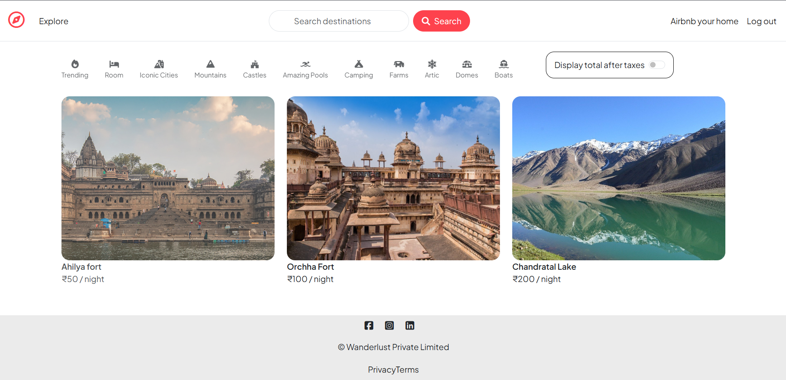
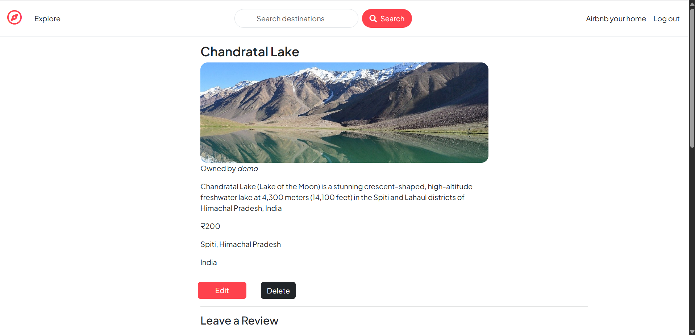
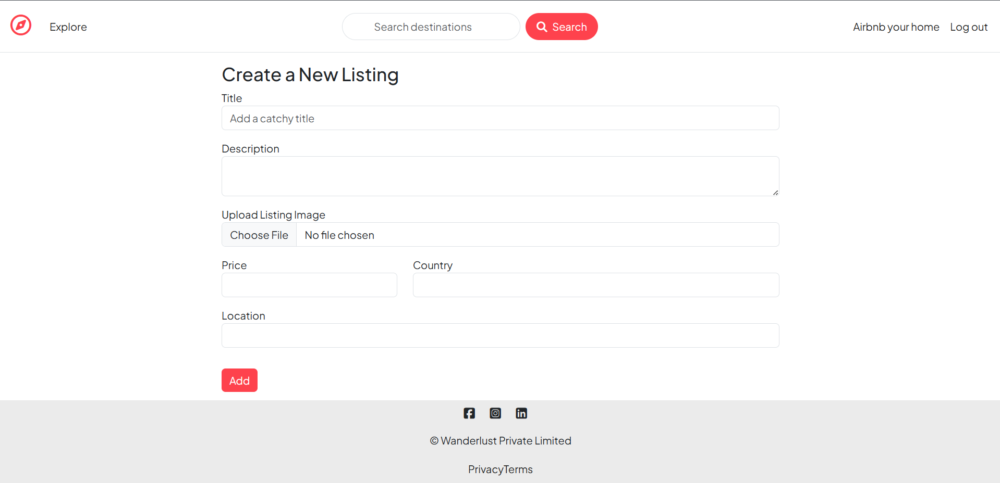
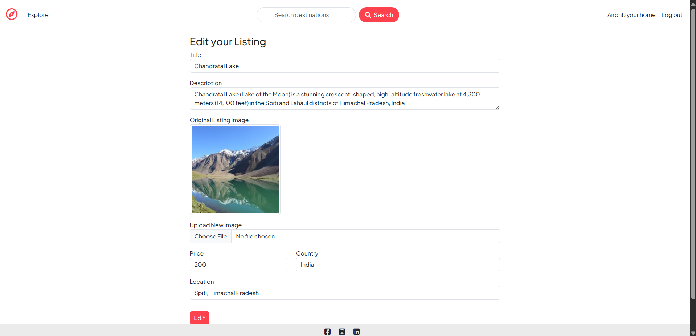
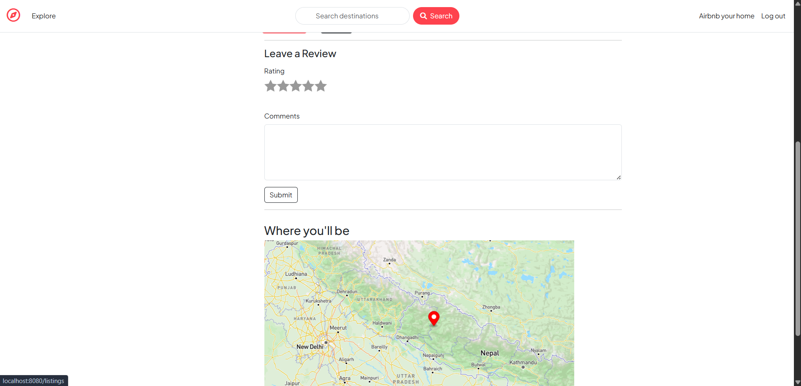
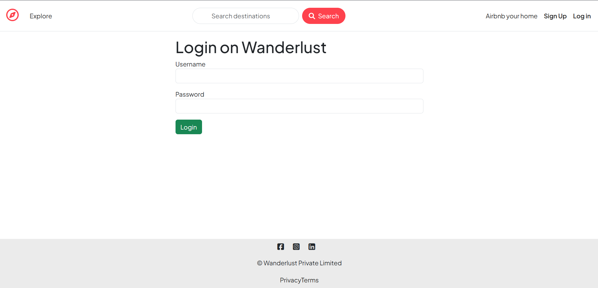
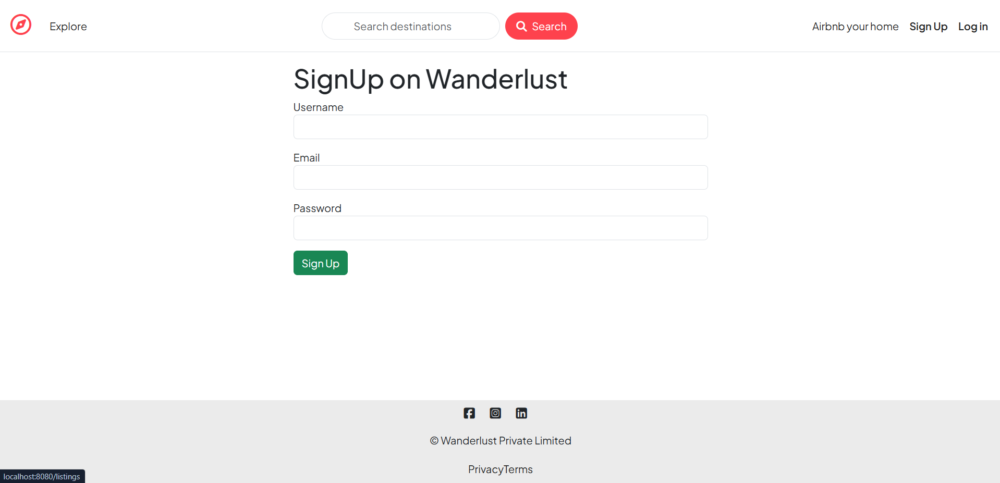

# 🏡 Wanderlust – Airbnb Inspired Rental Platform

Wanderlust is a full-stack accommodation rental platform inspired by Airbnb, built with **Node.js, Express.js, MongoDB, and EJS**. It lets users browse property listings, add new stays, leave reviews, and manage accommodations — complete with image uploads and interactive location maps.

## 🚀 Features

- 🔐 User Authentication & Authorization using Passport.js
- 🏠 Full CRUD operations for property listings
- ⭐ Review & Rating system for accommodations
- 🗺️ Interactive maps for listing locations using Mapbox
- ☁️ Image upload & cloud storage via Cloudinary
- 🍪 Persistent sessions stored in MongoDB (connect-mongo)
- 💬 Flash messages for real-time user feedback
- ✅ Server-side form validation using Joi
- 🧱 Centralized error handling with a custom error class
- 🏗️ Clean MVC architecture
- 📱 Fully responsive UI built with Bootstrap and EJS templates

## 📸 Screenshots

### 🏠 All Listings


### 📄 Show Listing


### ➕ New Listing


### ✏️ Edit Listing


### ⭐ Reviews & Map


### 🔐 Login


### 📝 Sign Up


## 🛠 Tech Stack

**Frontend**
- HTML5, CSS3
- Bootstrap
- EJS + EJS-Mate (layouts/partials)

**Backend**
- Node.js
- Express.js

**Database**
- MongoDB (Atlas)
- Mongoose

**Authentication & Security**
- Passport.js (Local Strategy)
- Passport-Local-Mongoose
- Express Session + connect-mongo

**Media & Maps**
- Cloudinary (image storage)
- Multer + Multer-Storage-Cloudinary
- Mapbox SDK (geocoding & maps)

**Validation & Utilities**
- Joi
- Connect Flash
- Method Override
- dotenv

## 📂 Project Structure

```
Wanderlust/
├── controllers/     # Route logic for listings, reviews & users
├── init/            # Database seed/initialization scripts
├── models/          # Mongoose schemas (Listing, Review, User)
├── public/          # Static assets (CSS, JS, images)
├── routes/          # Express route definitions
├── utils/           # Helper utilities (custom error handling, async wrapper)
├── views/           # EJS templates
├── app.js           # Application entry point
├── cloudconfig.js   # Cloudinary configuration
├── middleware.js     # Custom middleware (auth checks, validation)
├── schema.js         # Joi validation schemas
└── package.json
```

## ⚙️ Getting Started

### Prerequisites
- Node.js (v20+)
- MongoDB Atlas account (or local MongoDB instance)
- Cloudinary account (for image uploads)
- Mapbox account (for maps)

### Installation

```bash
# Clone the repository
git clone https://github.com/namanpatidar800/Wanderlust.git
cd Wanderlust

# Install dependencies
npm install
```

### Environment Variables

Create a `.env` file in the root directory and add:

```
ATLASDB_URL=your_mongodb_atlas_connection_string
SECRET=your_session_secret
CLOUD_NAME=your_cloudinary_cloud_name
CLOUD_API_KEY=your_cloudinary_api_key
CLOUD_API_SECRET=your_cloudinary_api_secret
MAP_TOKEN=your_mapbox_access_token
```

### Run the App

```bash
# Development (with auto-reload)
npm run dev

# Production
npm start
```

The app will be running at `http://localhost:8080` (or the port you've configured).

## 🎯 Learning Outcomes

Building this project involved hands-on experience with:

- Full-stack web development with the Node.js/Express ecosystem
- RESTful API design and MVC architecture
- Authentication & session management with Passport.js
- Database modeling and relationships in MongoDB/Mongoose
- Cloud-based image storage and handling file uploads
- Integrating third-party APIs (Cloudinary, Mapbox)
- Error handling and server-side validation best practices

## 👨‍💻 Developer

**Naman Patidar**
B.Tech CSE Student

- GitHub: [@namanpatidar800](https://github.com/namanpatidar800)
- LinkedIn: [namanpatidar](https://linkedin.com/in/namanpatidar)
- Live Demo: [Wanderlust](https://wanderlust-6mp3.onrender.com)

## 📄 License

This project is open source and available for learning purposes.
